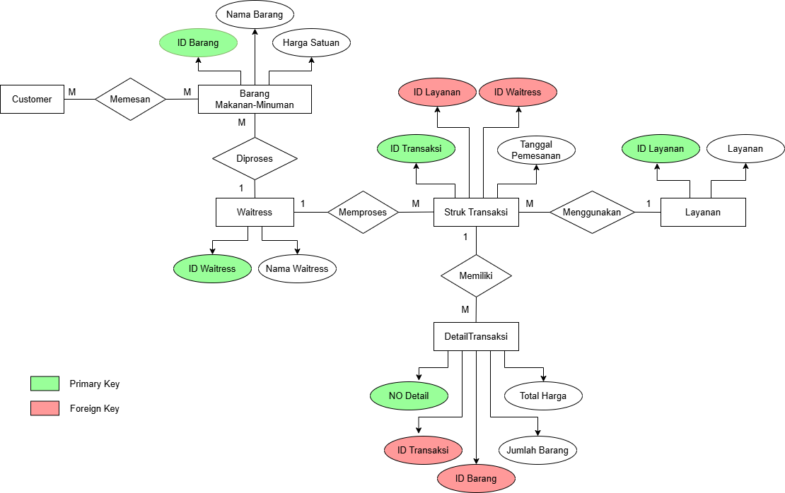
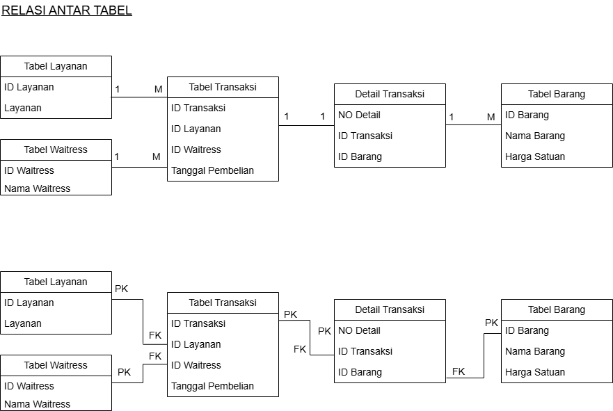

☕✨ UAS Pemrograman Basis Data

📄 Sistem Nota Transaksi Coffee Shop

📐 Entity Relationship Diagram (ERD)

ERD digunakan untuk menggambarkan struktur database serta hubungan antar entitas yang ada pada sistem Nota Coffee Shop. Diagram ini menjadi dasar dalam proses normalisasi dan pembuatan tabel pada database.

📌 Entitas Utama dalam ERD

1. barang
2. layanan
3. waitress
4. transaksi
5. detail_transaksi

Setiap entitas memiliki Primary Key (PK) dan saling terhubung menggunakan Foreign Key (FK) sesuai kebutuhan sistem.

🔗 Relasi Antar Tabel (Detail)

Relasi antar tabel dirancang untuk memastikan integritas data dan menghindari redundansi.

 

