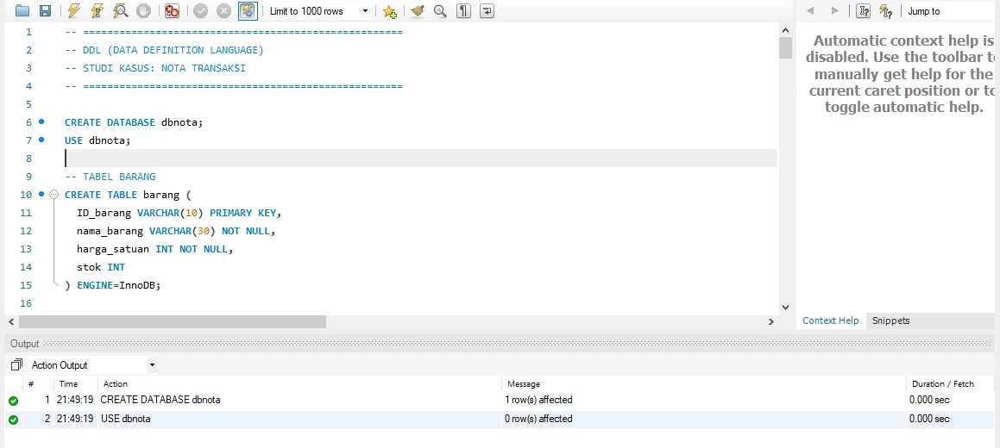

☕✨ UAS Pemrograman Basis Data

📄 Sistem Nota Transaksi Coffee Shop

📐 Entity Relationship Diagram (ERD)

ERD digunakan untuk menggambarkan struktur database serta hubungan antar entitas yang ada pada sistem Nota Coffee Shop. Diagram ini menjadi dasar dalam proses normalisasi dan pembuatan tabel pada database.

📌 Entitas Utama dalam ERD

1. barang
2. layanan
3. waitress
4. transaksi
5. detail_transaksi

Setiap entitas memiliki Primary Key (PK) dan saling terhubung menggunakan Foreign Key (FK) sesuai kebutuhan sistem.

🔗 Relasi Antar Tabel (Detail)

Relasi antar tabel dirancang untuk memastikan integritas data dan menghindari redundansi.

 

🧩 Rincian Relasi

barang (1) — (N) detail_transaksi
→ Satu barang dapat muncul di banyak detail transaksi

transaksi (1) — (N) detail_transaksi
→ Satu transaksi dapat memiliki banyak item barang

waitress (1) — (N) transaksi
→ Satu waitress dapat menangani banyak transaksi

layanan (1) — (N) transaksi
→ Satu jenis layanan dapat digunakan pada banyak transaksi

📌 Semua relasi diterapkan menggunakan Primary Key dan Foreign Key sesuai desain ERD.

🏗️ Data Definition Language (DDL)

DDL digunakan untuk mendefinisikan struktur database, mulai dari pembuatan database hingga tabel beserta relasinya.

 

